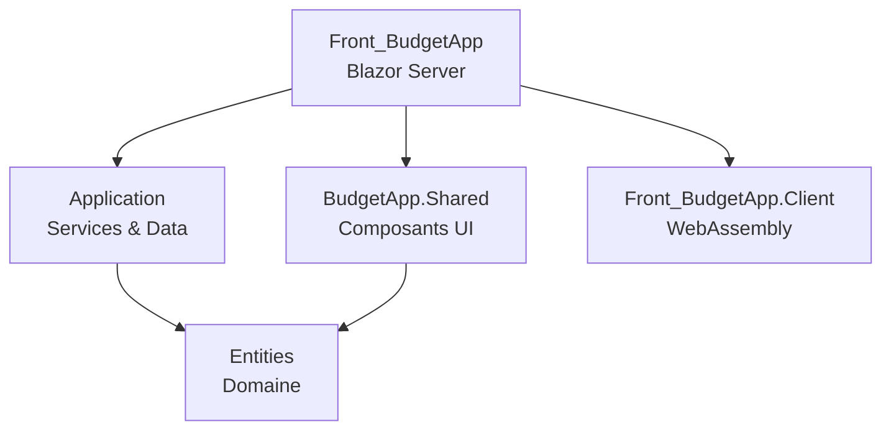

# Architecture - BudgetApp

## Vue d'ensemble

### Separation des responsabilites

**Projet Entities** (`Entities.csproj`)
- **Role** : Couche Domaine - Coeur de l'application
- **Responsabilites** :
  - Modeles du domaine (Transaction, DepenseFixe, Categorie, etc.)
  - DTOs pour les contrats API
  - Formulaires de saisie avec validation
  - Interfaces du domaine (IModel, ITransaction)
- **Dependances** : Aucune reference projet (projet racine)
- **Packages** : FluentValidation, FluentResults, Serilog

**Projet Application** (`Application.csproj`)
- **Role** : Couche Services & Persistance
- **Responsabilites** :
  - Logique metier via services
  - Acces donnees via EF Core
  - DbContext et migrations
  - Projections LINQ pour mapping efficace
- **Dependances** : `Entities`
- **Packages** : EF Core SqlServer, FluentValidation, FluentResults, Serilog

**Projet BudgetApp.Shared** (`BudgetApp.Shared.csproj`)
- **Role** : Composants UI partages (Razor Class Library)
- **Responsabilites** :
  - Composants Blazor reutilisables
  - Interfaces HTTP pour services frontend
  - Configuration Serilog centralisee
  - Outils partages (Icones)
- **Dependances** : `Entities`
- **Packages** : Blazor.Bootstrap, FluentValidation, Serilog

**Projet Front_BudgetApp** (`Front_BudgetApp.csproj`)
- **Role** : Application web principale (Blazor Server)
- **Responsabilites** :
  - Hebergement de l'application
  - Pages Blazor
  - API REST (Minimal APIs)
  - Services HTTP frontend
  - Background services
- **Dependances** : `Application`, `BudgetApp.Shared`, `Front_BudgetApp.Client`
- **Packages** : Blazor.Bootstrap, EF Core, Swashbuckle

**Projet Front_BudgetApp.Client** (`Front_BudgetApp.Client.csproj`)
- **Role** : Client WebAssembly (si besoin d'interactivite cote client)
- **Responsabilites** : Composants interactifs cote client
- **Dependances** : Aucune (projet minimal)

## Diagramme de dependances



## Dependency Injection

### Services enregistres (Program.cs)

```csharp
// DbContext
builder.Services.AddDbContext<MyDbContext>(options =>
    options.UseSqlServer(builder.Configuration.GetConnectionString("DefaultConnection")));

// Services metier (Scoped - par requete)
builder.Services.AddScoped<IDepenseFixeService, DepenseFixeService>();
builder.Services.AddScoped<ITranscationService, TransactionService>();
builder.Services.AddScoped<ICategorieService, CategorieService>();

// Services HTTP frontend (Scoped)
builder.Services.AddScoped<IHttpCategorie, CategorieFrontService>();
builder.Services.AddScoped<IHttpDepenseFixe, DepenseFixeFrontService>();
builder.Services.AddScoped<IHttpTransaction, TransactionFrontService>();

// Services UI (Scoped)
builder.Services.AddScoped<IAppToastService, AppToastService>();

// Background Service (Singleton implicite)
builder.Services.AddHostedService<DepenseFixeScheduler>();

// HttpClient pour appels API internes
builder.Services.AddHttpClient("Api", x =>
    x.BaseAddress = new Uri("http://localhost:5201/api/"));
```

**Analyse des lifetimes** :
- **Scoped** : Services metier et HTTP - une instance par requete HTTP, permet l'injection du DbContext
- **Singleton** : DepenseFixeScheduler - tourne en permanence en arriere-plan
- **Transient** : Aucun - pas necessaire pour ce projet

## Architecture Base de donnees

### DbContext

```csharp
public class MyDbContext : DbContext
{
    public DbSet<DepenseFixe> DepenseFixes => Set<DepenseFixe>();
    public DbSet<TransactionVariable> TransactionVariables => Set<TransactionVariable>();
    public DbSet<Categorie> Categories => Set<Categorie>();
    public DbSet<Rappel> Rappels => Set<Rappel>();
    public DbSet<DepenseDueDate> DepenseDueDates => Set<DepenseDueDate>();
    public DbSet<DepenseMois> DepensesMois => Set<DepenseMois>();
}
```

### Strategie d'heritage : TPH (Table Per Hierarchy)
- Table unique `Transactions` avec discriminateur `TransactionTable`
- Valeurs : `"Fixe"` pour DepenseFixe, `"Variable"` pour TransactionVariable
- Colonnes nullables pour proprietes specifiques a chaque type

### Triggers SQL configures
- `TG_UpdateTransaction` - MAJ automatique UpdatedAt
- `TG_UpdateCategorie` - MAJ automatique UpdatedAt
- `TG_UpdateDepenseDueDates` - MAJ automatique UpdatedAt
- `TG_UpdateRappel` - MAJ automatique UpdatedAt
- `TG_UpdateDepenseMois` - MAJ automatique UpdatedAt

### Seed Data
- Categorie par defaut "NoCategory" (Id=1)

## Architecture API

### Minimal APIs - Organisation par domaine

```csharp
// Endpoints groupes
app.MapDepenseFixe();        // /api/depensefixe
app.MapTransactionVariable(); // /api/transaction
app.MapCategorie();          // /api/categorie
```

### Endpoints disponibles

**Depenses Fixes** (`/api/depensefixe`)
| Methode | Route | Description |
|---------|-------|-------------|
| GET | `/` | Liste toutes les depenses |
| GET | `/{id}` | Recupere une depense |
| POST | `/` | Cree une depense |
| PUT | `/{id}` | Met a jour une depense |
| DELETE | `/{id}` | Supprime une depense |
| PATCH | `/rappels/{id}/vu` | Marque rappel comme lu |
| PATCH | `/{id}/categorie` | Change la categorie |
| PATCH | `/{id}/duedate` | Change l'echeance |

**Transactions** (`/api/transaction`)
| Methode | Route | Description |
|---------|-------|-------------|
| GET | `/{id}` | Recupere une transaction |
| GET | `/revenubymonth/{month}` | Revenus du mois |
| GET | `/depensebymonth/{month}` | Depenses du mois |
| POST | `/` | Cree une transaction |
| PUT | `/{id}` | Met a jour |
| DELETE | `/{id}` | Supprime |
| PATCH | `/{id}/categorie` | Change la categorie |

**Categories** (`/api/categorie`)
| Methode | Route | Description |
|---------|-------|-------------|
| GET | `/` | Liste toutes les categories |
| GET | `/{id}` | Recupere une categorie |
| POST | `/` | Cree une categorie |
| PUT | `/{id}` | Met a jour |
| DELETE | `/{id}` | Supprime |

## Background Services

### DepenseFixeScheduler

**Frequence** : Toutes les heures
**Role** : Maintenance automatique des echeances et rappels

**Operations** :
1. **Nettoyage** : Suppression des echeances et rappels expires (> 4 jours)
2. **Generation** : Creation des prochaines echeances si horizon < 2 mois

## Points d'amelioration potentiels

1. **Namespace inconsistant** : `Application.csproj` contient encore `<RootNamespace>Datas</RootNamespace>`

2. **Faute de frappe** : `ITranscationService` devrait etre `ITransactionService`

3. **Overhead HTTP interne** : En Blazor Server, les composants pourraient injecter directement les services metier au lieu de passer par HTTP

4. **Pas de tests** : Aucun projet de tests unitaires ou d'integration

5. **Validation cote serveur** : Ajouter validation FluentValidation dans les endpoints API

## References
- [[README]] - Vue d'ensemble du projet
- [[Entites]] - Modele de donnees
- [[Log-Decisions]] - Historique des decisions
