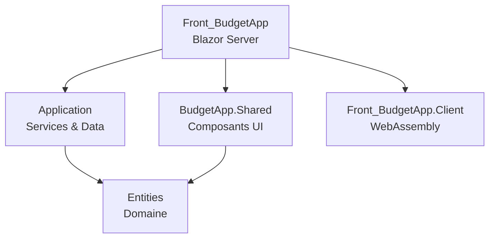

# Architecture - BudgetApp

## Vue d'ensemble

### Separation des responsabilites

**Projet Entities** (`Entities.csproj`)
- **Role** : Couche Domaine - Coeur de l'application
- **Responsabilites** :
  - Modeles du domaine (Transaction, DepenseFixe, Categorie, etc.)
  - DTOs pour les contrats API
  - Formulaires de saisie avec validation
  - Interfaces du domaine (IModel, ITransaction)
- **Dependances** : Aucune reference projet (projet racine)
- **Packages** : FluentValidation, FluentResults, Serilog

**Projet Application** (`Application.csproj`)
- **Role** : Couche Services & Persistance
- **Responsabilites** :
  - Logique metier via services
  - Acces donnees via EF Core
  - DbContext et migrations
  - Projections LINQ pour mapping efficace
- **Dependances** : `Entities`
- **Packages** : EF Core SqlServer, FluentValidation, FluentResults, Serilog

**Projet BudgetApp.Shared** (`BudgetApp.Shared.csproj`)
- **Role** : Composants UI partages (Razor Class Library)
- **Responsabilites** :
  - Composants Blazor reutilisables
  - Interfaces HTTP pour services frontend
  - Configuration Serilog centralisee
  - Outils partages (Icones)
- **Dependances** : `Entities`
- **Packages** : Blazor.Bootstrap, FluentValidation, Serilog

**Projet Front_BudgetApp** (`Front_BudgetApp.csproj`)
- **Role** : Application web principale (Blazor Server)
- **Responsabilites** :
  - Hebergement de l'application
  - Pages Blazor
  - API REST (Minimal APIs)
  - Services HTTP frontend
  - Authentification frontend (JWT + AuthorizeView)
  - Background services
- **Dependances** : `Application`, `BudgetApp.Shared`, `Front_BudgetApp.Client`
- **Packages** : Blazor.Bootstrap, EF Core, Swashbuckle, JWT Bearer

**Projet Front_BudgetApp.Client** (`Front_BudgetApp.Client.csproj`)
- **Role** : Client WebAssembly (si besoin d'interactivite cote client)
- **Responsabilites** : Composants interactifs cote client
- **Dependances** : Aucune (projet minimal)

## Diagramme de dependances



## Dependency Injection

### Services enregistres (Program.cs)

```csharp
// DbContext
builder.Services.AddDbContext<MyDbContext>(options =>
    options.UseSqlServer(builder.Configuration.GetConnectionString("DefaultConnection")));

// Services metier (Scoped - par requete)
builder.Services.AddScoped<IDepenseFixeService, DepenseFixeService>();
builder.Services.AddScoped<ITranscationService, TransactionService>();
builder.Services.AddScoped<ICategorieService, CategorieService>();

// Securite
builder.Services.AddScoped<IUserService, UserService>();
builder.Services.AddScoped<IAuthService, AuthService>();
builder.Services.AddScoped<IPasswordHasher, PasswordManager>();
builder.Services.AddSingleton<IJwtTokenGenerator, JwtTokenGenerator>();

// Authentification Blazor
builder.Services.AddScoped<ProtectedLocalStorage>();
builder.Services.AddScoped<AuthStateService>();
builder.Services.AddScoped<AuthenticationStateProvider, CustomAuthStateProvider>();
builder.Services.AddCascadingAuthenticationState();

// Services HTTP frontend (Scoped)
builder.Services.AddScoped<IHttpCategorie, CategorieFrontService>();
builder.Services.AddScoped<IHttpDepenseFixe, DepenseFixeFrontService>();
builder.Services.AddScoped<IHttpTransaction, TransactionFrontService>();
builder.Services.AddScoped<IHttpRapport, RapportFrontService>();

// Services UI (Scoped)
builder.Services.AddScoped<IAppToastService, AppToastService>();

// Background Service (Singleton implicite)
builder.Services.AddHostedService<DepenseFixeScheduler>();

// HttpClient pour appels API internes (sans DelegatingHandler)
builder.Services.AddHttpClient("Api", x =>
    x.BaseAddress = new Uri("http://localhost:5201/api/"));
```

**Analyse des lifetimes** :
- **Scoped** : Services metier, HTTP et auth - une instance par requete HTTP, permet l'injection du DbContext
- **Singleton** : DepenseFixeScheduler, JwtTokenGenerator - tourne en permanence en arriere-plan
- **Transient** : Aucun - pas necessaire pour ce projet

## Architecture Base de donnees

### DbContext

```csharp
public class MyDbContext : DbContext
{
    public DbSet<DepenseFixe> DepenseFixes => Set<DepenseFixe>();
    public DbSet<TransactionVariable> TransactionVariables => Set<TransactionVariable>();
    public DbSet<Categorie> Categories => Set<Categorie>();
    public DbSet<Rappel> Rappels => Set<Rappel>();
    public DbSet<DepenseDueDate> DepenseDueDates => Set<DepenseDueDate>();
    public DbSet<DepenseMois> DepensesMois => Set<DepenseMois>();
}
```

### Strategie d'heritage : TPH (Table Per Hierarchy)
- Table unique `Transactions` avec discriminateur `TransactionTable`
- Valeurs : `"Fixe"` pour DepenseFixe, `"Variable"` pour TransactionVariable
- Colonnes nullables pour proprietes specifiques a chaque type

### Triggers SQL configures
- `TG_UpdateTransaction` - MAJ automatique UpdatedAt
- `TG_UpdateCategorie` - MAJ automatique UpdatedAt
- `TG_UpdateDepenseDueDates` - MAJ automatique UpdatedAt
- `TG_UpdateRappel` - MAJ automatique UpdatedAt
- `TG_UpdateDepenseMois` - MAJ automatique UpdatedAt

### Tables supplementaires (Securite)

```csharp
public DbSet<User> Users => Set<User>();
public DbSet<RefreshToken> RefreshTokens => Set<RefreshToken>();
```

### Isolation des donnees par utilisateur

- `Transaction` (classe de base TPH) possede un `UserId` (FK vers `Users`)
- Relation : `User (1:N) <-- Transaction`
- Default value `UserId = 1` pour les donnees existantes
- Les services filtrent toutes les requetes par `userId` (`Where(t => t.UserId == userId)`)
- Les endpoints extraient le `userId` du JWT via `ClaimTypes.NameIdentifier`
- Les **categories restent globales** (pas de filtre par userId)

### Seed Data
- Categorie par defaut "NoCategory" (Id=1)

## Architecture API

### Minimal APIs - Organisation par domaine

```csharp
// Endpoints groupes
app.MapDepenseFixe();        // /api/depensefixe
app.MapTransactionVariable(); // /api/transaction
app.MapCategorie();          // /api/categorie
app.MapRapport();            // /api/rapport
app.MapAuth();               // /api/auth
```

### Endpoints disponibles

**Depenses Fixes** (`/api/depensefixe`)
| Methode | Route | Description |
|---------|-------|-------------|
| GET | `/` | Liste toutes les depenses |
| GET | `/{id}` | Recupere une depense |
| POST | `/` | Cree une depense |
| PUT | `/{id}` | Met a jour une depense |
| DELETE | `/{id}` | Supprime une depense |
| PATCH | `/rappels/{id}/vu` | Marque rappel comme lu |
| PATCH | `/{id}/categorie` | Change la categorie |
| PATCH | `/{id}/duedate` | Change l'echeance |
| PATCH | `/{id}/echelonnement` | Active l'echelonnement |

**Transactions** (`/api/transaction`)
| Methode | Route | Description |
|---------|-------|-------------|
| GET | `/{id}` | Recupere une transaction |
| GET | `/revenubymonth/{month}` | Revenus du mois |
| GET | `/depensebymonth/{month}` | Depenses du mois |
| POST | `/` | Cree une transaction |
| PUT | `/{id}` | Met a jour |
| DELETE | `/{id}` | Supprime |
| PATCH | `/{id}/categorie` | Change la categorie |

**Categories** (`/api/categorie`)
| Methode | Route | Description |
|---------|-------|-------------|
| GET | `/` | Liste toutes les categories |
| GET | `/{id}` | Recupere une categorie |
| POST | `/` | Cree une categorie |
| PUT | `/{id}` | Met a jour |
| DELETE | `/{id}` | Supprime |

**Rapport** (`/api/rapport`)
| Methode | Route | Description |
|---------|-------|-------------|
| GET | `/{annee}/{mois}` | Rapport mensuel |

**Authentification** (`/api/auth`)
| Methode | Route | Description |
|---------|-------|-------------|
| POST | `/login` | Connexion (retourne JWT + RefreshToken) |
| POST | `/refresh` | Rafraichir le token |

## Authentification & Securite

### Architecture

L'authentification utilise **JWT Bearer** cote API et **AuthorizeView Blazor** cote frontend.

### Flux

```
Login → POST /api/auth/login → JWT AccessToken + RefreshToken
     → AuthStateService.SaveSessionAsync() → ProtectedLocalStorage
     → CustomAuthStateProvider.NotifyAuthStateChanged()
     → AuthorizeView → Authorized → MainLayout affiche le contenu
```

### Composants frontend

| Composant | Fichier | Role |
|-----------|---------|------|
| `AuthStateService` | `Services/Securite/` | Session via ProtectedLocalStorage + cache memoire |
| `CustomAuthStateProvider` | `Services/Securite/` | Fournit l'etat auth a Blazor |
| `MainLayout` | `Components/Layout/` | `AuthorizeView` protege les pages |
| `LoginLayout` | `Components/Layout/` | Layout public (login, error) |
| `RedirectToLogin` | `Components/Layout/` | Redirige vers `/login` si non authentifie |

### Layouts et protection

| Layout | Protection | Pages |
|--------|-----------|-------|
| `MainLayout` | `AuthorizeView` (auth requise) | Home, DepenseFixe, Categories |
| `LoginLayout` | Aucune (public) | Login, Error |

### Token JWT dans les FrontServices

Les FrontServices injectent `AuthStateService` et ajoutent le token via `GetClientAsync()` :

```csharp
private async Task<HttpClient> GetClientAsync()
{
    var client = factory.CreateClient("Api");
    var token = await authState.GetAccessTokenAsync();
    if (!string.IsNullOrEmpty(token))
        client.DefaultRequestHeaders.Authorization =
            new AuthenticationHeaderValue("Bearer", token);
    return client;
}
```

> **Decision** : Le `JwtAuthorizationHandler` (DelegatingHandler) est desactive car ProtectedLocalStorage (JS interop) n'est pas accessible dans le contexte du handler HTTP. Le token est ajoute directement dans chaque FrontService.

### Configuration Blazor

- `App.razor` : `InteractiveServerRenderMode(prerender: false)`
- `Routes.razor` : `CascadingAuthenticationState` + `RouteView` (pas AuthorizeRouteView)
- Pages protegees : chargent les donnees dans `OnAfterRenderAsync(firstRender)` pour garantir la disponibilite de JS interop

## Background Services

### DepenseFixeScheduler

**Frequence** : Toutes les heures
**Role** : Maintenance automatique des echeances et rappels

**Operations** :
1. **Nettoyage** : Suppression des rappels vus et expires (> 5 jours)
2. **Echelonnement** : Pour les depenses echelonnees (`IsEchelonne && EcheancesRestantes > 0`), cree une TransactionVariable mensuelle automatique avec la date de paiement calculee depuis la premiere DueDate. Decremente `EcheancesRestantes` et cree un rappel. La derniere echeance est ajustee pour correspondre au montant total.
3. **Generation** : Creation des prochaines echeances si horizon < 2 mois (depenses non echelonnees uniquement)

## Points d'amelioration potentiels

1. **Namespace inconsistant** : `Application.csproj` contient encore `<RootNamespace>Datas</RootNamespace>`

2. **Faute de frappe** : `ITranscationService` devrait etre `ITransactionService`

3. **Overhead HTTP interne** : En Blazor Server, les composants pourraient injecter directement les services metier au lieu de passer par HTTP

4. **Pas de tests** : Aucun projet de tests unitaires ou d'integration

5. **Validation cote serveur** : Ajouter validation FluentValidation dans les endpoints API

## Deploiement

### Docker

Dockerfile multi-stage a la racine du projet :

```bash
docker build -t budgetapp .
docker run -p 5201:5201 budgetapp
```

**Images utilisees :**
- Build : `mcr.microsoft.com/dotnet/sdk:10.0`
- Runtime : `mcr.microsoft.com/dotnet/aspnet:10.0`

**Variables d'environnement :**
- `ASPNETCORE_ENVIRONMENT=Production`
- `ASPNETCORE_URLS=http://+:5201`

### Reverse Proxy (Traefik)

Architecture avec SSL termination :

```
Client → HTTPS → Traefik → HTTP:5201 → BudgetApp
```

`UseHttpsRedirection()` et `UseHsts()` sont desactives car Traefik gere HTTPS.

### Static Web Assets

| Mode | Comportement |
|------|-------------|
| `dotnet run` (Dev) | Assets mappes dynamiquement depuis packages NuGet |
| `dotnet publish` / Docker | Assets copies physiquement dans le build |

> **Attention** : `dotnet run --launch-profile "http Prod"` ne fonctionne pas pour les static assets car ils ne sont mappes qu'en Development. Utiliser `dotnet publish` ou Docker pour tester Production.

## References
- [[README]] - Vue d'ensemble du projet
- [[Entites]] - Modele de donnees
- [[Log-Decisions]] - Historique des decisions
