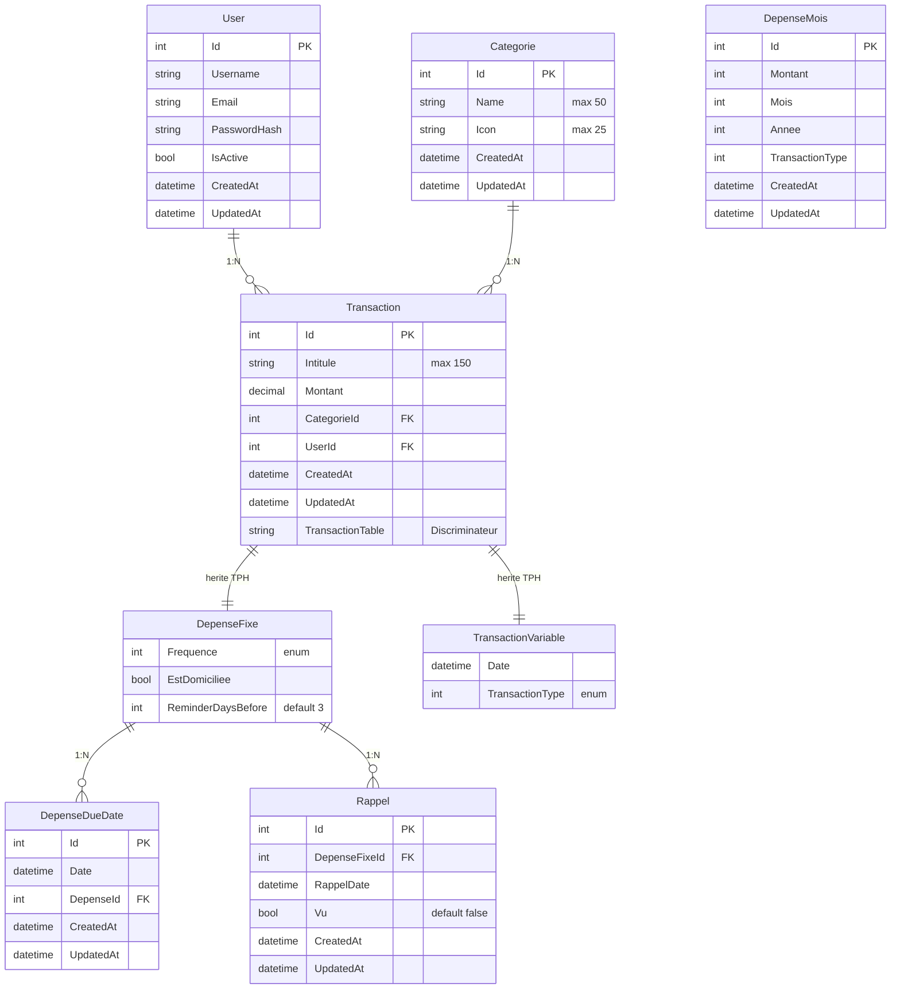

# Entites - BudgetApp

## Modele de donnees

### Diagramme des relations



---

## Entites detaillees

### Transaction (Classe de base)

**Fichier** : `Entities/Domain/Models/Transaction.cs`

**Proprietes** :
```csharp
public class Transaction : ITransaction
{
    public int Id { get; set; }
    public string Intitule { get; set; } = String.Empty;
    public decimal Montant { get; set; }
    public int CategorieId { get; set; }
    public Categorie Categorie { get; set; }
    public int UserId { get; set; }
    public User User { get; set; }
    public DateTime CreatedAt { get; set; }
    public DateTime UpdatedAt { get; set; }
}
```

**Relations** :
- `Categorie` (N:1) - Navigation property vers la categorie
- `User` (N:1) - Proprietaire de la transaction (FK `UserId`)

**Notes** :
- Classe de base pour l'heritage TPH
- Discriminateur `TransactionTable` dans la table SQL
- `UserId` a un default value de 1 (donnees existantes attribuees au premier utilisateur)

---

### DepenseFixe (herite de Transaction)

**Fichier** : `Entities/Domain/Models/DepenseFixe.cs`

**Proprietes** :
```csharp
public class DepenseFixe : Transaction
{
    public Frequence Frequence { get; set; }
    public bool EstDomiciliee { get; set; }
    public ICollection<DepenseDueDate> DueDates { get; set; }
    public int ReminderDaysBefore { get; set; } = 3;
    public ICollection<Rappel> Rappels { get; set; } = new List<Rappel>();
}

public enum Frequence
{
    Mensuel = 12,      // 12 fois par an
    Trimestriel = 4,   // 4 fois par an
    Biannuel = 2,      // 2 fois par an
    Annuel = 1         // 1 fois par an
}
```

**Relations** :
- `DueDates` (1:N) - Collection des echeances
- `Rappels` (1:N) - Collection des rappels

**Logique metier** :
- `EstDomiciliee = true` -> Pas de rappels affiches
- `ReminderDaysBefore` -> Nombre de jours avant echeance pour rappel
- `Frequence` -> Determine le calcul des prochaines echeances

---

### TransactionVariable (herite de Transaction)

**Fichier** : `Entities/Domain/Models/TransactionVariable.cs`

**Proprietes** :
```csharp
public class TransactionVariable : Transaction
{
    public DateTime Date { get; set; }
    public TransactionType TransactionType { get; set; }
}

public enum TransactionType
{
    Revenu,
    Depense
}
```

**Relations** :
- Herite de Transaction (Categorie)

**Logique metier** :
- `TransactionType.Revenu` -> Affiche en vert (+)
- `TransactionType.Depense` -> Affiche en rouge (-)

---

### Categorie

**Fichier** : `Entities/Domain/Models/Categorie.cs`

**Proprietes** :
```csharp
public class Categorie : IModel
{
    public int Id { get; set; }
    public string Name { get; set; } = "";
    public string Icon { get; set; } = "";
    public DateTime CreatedAt { get; set; }
    public DateTime UpdatedAt { get; set; }
    public IEnumerable<Transaction> Transactions { get; set; } = new List<Transaction>();
}
```

**Relations** :
- `Transactions` (1:N) - Toutes les transactions de cette categorie

**Seed Data** :
- Categorie par defaut : Id=1, Name="NoCategory"

---

### DepenseDueDate

**Fichier** : `Entities/Domain/Models/DepenseDueDate.cs`

**Proprietes** :
```csharp
public class DepenseDueDate : IModel
{
    public int Id { get; set; }
    public DateTime Date { get; set; }
    public int DepenseId { get; set; }
    public DepenseFixe Depense { get; set; }
    public DateTime CreatedAt { get; set; }
    public DateTime UpdatedAt { get; set; }
}
```

**Relations** :
- `Depense` (N:1) - Reference vers la depense fixe

**Logique metier** :
- Generees automatiquement par le DepenseFixeScheduler
- Horizon de generation : 2 mois
- Retention : 4 jours apres echeance

---

### Rappel

**Fichier** : `Entities/Domain/Models/Rappel.cs`

**Proprietes** :
```csharp
public class Rappel : IModel
{
    public int Id { get; set; }
    public int DepenseFixeId { get; set; }
    public DepenseFixe DepenseFixe { get; set; } = null!;
    public DateTime RappelDate { get; set; }
    public bool Vu { get; set; } = false;
    public DateTime CreatedAt { get; set; }
    public DateTime UpdatedAt { get; set; }
}
```

**Relations** :
- `DepenseFixe` (N:1) - Reference vers la depense fixe

**Logique metier** :
- Generes pour les depenses non domiciliees
- 3 rappels par echeance : N jours avant, 1 jour avant, le jour meme
- `Vu = false` -> Affiche icone cloche dans l'UI

---

## DTOs

### DepenseFixeDto
```csharp
public record DepenseFixeDto(
    int Id,
    string Intitule,
    decimal Montant,
    CategorieDto Categorie,
    Frequence Frequence,
    bool EstDomiciliee,
    IReadOnlyList<DepenseDueDateDto> DueDates,
    int ReminderDaysBefore,
    IReadOnlyList<RappelDto> Rappels
);
```

### TransactionVariableDto
```csharp
public record TransactionVariableDto(
    int Id,
    string Intitule,
    decimal Montant,
    DateTime Date,
    TransactionType TransactionType,
    CategorieDto Categorie
);
```

### CategorieDto
```csharp
public record CategorieDto(
    int Id,
    string Name,
    string Icon
);
```

### RappelDto
```csharp
public record RappelDto(
    int Id,
    DateTime RappelDate,
    bool Vu
);
```

### DepenseDueDateDto
```csharp
public record DepenseDueDateDto(
    int Id,
    DateTime date
);
```

---

## Index et contraintes

### Table Transactions
- PK : `Id` (Identity)
- FK : `CategorieId` -> Categories.Id
- FK : `UserId` -> Users.Id (default 1)
- Index : `TransactionTable` (discriminateur TPH)

### Table Categories
- PK : `Id` (Identity)
- Unique : `Name` [A clarifier - pas explicite dans le code]

### Table DepenseDueDates
- PK : `Id` (Identity)
- FK : `DepenseId` -> Transactions.Id (cascade delete)

### Table Rappels
- PK : `Id` (Identity)
- FK : `DepenseFixeId` -> Transactions.Id (cascade delete)

---

## Notes sur le design

### Choix TPH (Table Per Hierarchy)
- **Avantage** : Une seule table, requetes simples
- **Inconvenient** : Colonnes nullables pour proprietes specifiques
- **Alternative a considerer** : TPT si les types divergent beaucoup

### Separation DTO/Entity
- Les DTOs utilisent des `record` (immutables)
- Les entites utilisent des `class` (mutables pour EF Core)
- Projections LINQ dans `ProjectionDto.cs` pour mapping efficace

### Audit Trail
- `CreatedAt` et `UpdatedAt` sur toutes les entites
- MAJ automatique via triggers SQL

---

## References
- [[README]] - Vue d'ensemble du projet
- [[Architecture]] - Details architecture
- [[Log-Decisions]] - Historique des decisions
