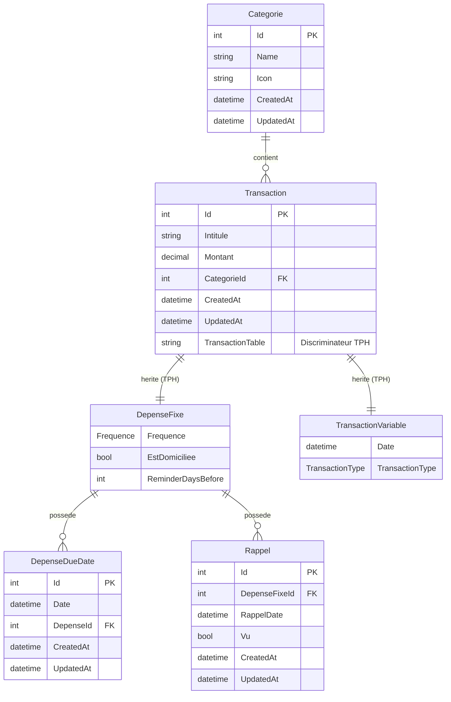

# BudgetApp

## Objectif du projet
**Probleme resolu** : Gestion des depenses personnelles avec suivi des depenses fixes recurrentes et des transactions variables (revenus/depenses ponctuelles)
**Type d'application** : Blazor Server avec API REST integree
**Utilisateurs cibles** : Usage personnel pour le suivi budgetaire

## Stack technique actuelle

### Frontend
- **Blazor Server** (.NET 10.0)
- **Blazor.Bootstrap** 3.5.0 - Composants UI Bootstrap pour Blazor
- **Theme Dark Mode** personnalise (bleu-gris et orange)
- Composants principaux :
  - `Home.razor` - Tableau de bord avec totaux du mois en cours
  - `DepenseFixe_C.razor` - Grille des depenses fixes avec statistiques
  - `TransactionVariable_C.razor` - Gestion des transactions variables
  - `Rapport_C.razor` - Rapport mensuel avec filtres par categorie
  - `Categories_C.razor` - Gestion des categories
  - `CategorieForm_C.razor` - Formulaire de categorie

### Backend
- **.NET 10.0** avec ASP.NET Core Minimal APIs
- Services :
  - `DepenseFixeService` - CRUD + generation echeances
  - `TransactionService` - CRUD transactions variables
  - `CategorieService` - CRUD categories
  - `RapportService` - Generation des rapports mensuels
  - `DepenseFixeScheduler` - Service de maintenance planifie (BackgroundService)

### Base de donnees
- **SQL Server** avec Entity Framework Core 10.0.1
- Connexion : `192.168.50.48` / Database `BudgetDB`
- Migrations : 1 migration initiale (20251222150225_Initial)

### Packages NuGet notables
| Package | Version | Role |
|---------|---------|------|
| Blazor.Bootstrap | 3.5.0 | Composants UI (Grid, Modal, Alert, etc.) |
| FluentValidation | 12.1.1 | Validation declarative des formulaires |
| FluentResults | 4.0.0 | Gestion d'erreurs sans exceptions |
| Serilog | 4.3.1-dev | Logging structure |
| Swashbuckle | 10.0.1 | Documentation API Swagger |

## Architecture detectee

### Structure de la solution
```
BudgetApp/
├── Entities/                         # Domaine (Models, DTOs, Forms, Interfaces)
│   ├── Domain/
│   │   ├── Models/                   # Transaction, DepenseFixe, Categorie, etc.
│   │   └── Interfaces/               # IModel, ITransaction
│   └── Contracts/
│       ├── Dtos/                     # DepenseFixeDto, CategorieDto, etc.
│       ├── Forms/                    # DepenseFixeForm, CategorieForm, etc.
│       └── Validations/              # Validators FluentValidation
│
├── Application/                      # Logique metier & persistance
│   ├── Interfaces/                   # IDepenseFixeService, ICategorieService, etc.
│   ├── Services/                     # Implementations des services
│   ├── Persistence/
│   │   ├── MyDbContext.cs            # DbContext EF Core
│   │   └── Migrations/               # Migrations EF Core
│   ├── Projections/                  # Expressions LINQ pour mapping efficace
│   ├── Mappers/                      # Extensions de mapping DTO
│   └── Tools/                        # ResultEnum
│
├── BudgetApp.Shared/                 # Composants Blazor partages
│   ├── Components/
│   │   ├── Transactions/             # DepenseFixe_C, TransactionVariable_C
│   │   └── Categories/               # Categories_C, CategorieForm_C
│   ├── Interfaces/Http/              # IHttpDepenseFixe, IHttpCategorie, IHttpTransaction
│   ├── Services/Notifications/       # IAppToastService
│   └── Tools/                        # SerilogConfig, Icones
│
└── Front_BudgetApp/
    ├── Front_BudgetApp/              # Application Blazor Server principale
    │   ├── Components/
    │   │   ├── Pages/                # DepenseFixePage, CategoriesPage, Home
    │   │   └── Layout/               # MainLayout, NavMenu
    │   ├── Api/Endpoints/            # Minimal APIs REST
    │   ├── Services/                 # Services HTTP frontend
    │   └── Tools/                    # DepenseFixeScheduler
    └── Front_BudgetApp.Client/       # Projet client (WebAssembly si besoin)
```

### Organisation du code
**Modeles** : `Entities/Domain/Models/` - Transaction, DepenseFixe, TransactionVariable, Categorie, Rappel, DepenseDueDate
**Services** : `Application/Services/` - DepenseFixeService, TransactionService, CategorieService
**Pages Blazor** : `Front_BudgetApp/Components/Pages/` - DepenseFixePage (avec onglets), CategoriesPage, Home
**Composants reutilisables** : `BudgetApp.Shared/Components/` - DepenseFixe_C, TransactionVariable_C, Categories_C

### Patterns identifies
- [x] **Clean Architecture** : Separation Entities/Application/Presentation
- [x] **Service Pattern** : Services metier injectes via DI
- [x] **Repository-like** : Services encapsulent l'acces DbContext
- [x] **Dependency Injection** : Tous services enregistres dans Program.cs
- [x] **Result Pattern** : FluentResults pour gestion d'erreurs
- [x] **TPH (Table Per Hierarchy)** : Heritage Transaction -> DepenseFixe/TransactionVariable
- [x] **Minimal APIs** : Endpoints REST groupes par domaine
- [ ] CQRS : Non

## Entites et relations



## Configuration et startup

**Program.cs** :
- Services enregistres :
  - `IDepenseFixeService` -> `DepenseFixeService`
  - `ITranscationService` -> `TransactionService`
  - `ICategorieService` -> `CategorieService`
  - `IHttpDepenseFixe` -> `DepenseFixeFrontService`
  - `IHttpCategorie` -> `CategorieFrontService`
  - `IHttpTransaction` -> `TransactionFrontService`
  - `IAppToastService` -> `AppToastService`
- Background Service : `DepenseFixeScheduler` (maintenance horaire)
- Middleware : StaticFiles, Antiforgery, Swagger (dev)
- HttpClient : Configure pour appeler l'API locale

## Etat actuel du developpement

**Fonctionnalites implementees** :
- [x] CRUD Depenses fixes avec echeances et rappels
- [x] CRUD Transactions variables (revenus/depenses)
- [x] CRUD Categories
- [x] Statistiques mensuelles (totaux, solde)
- [x] Alertes rappels urgents (< 3 jours)
- [x] Navigation par mois pour transactions
- [x] Scheduler de maintenance automatique
- [x] **Tableau de bord** - Totaux revenus/depenses/solde du mois en cours + 5 dernieres transactions
- [x] **Rapport mensuel** - Liste des transactions avec filtres par categorie, couleurs rouge/vert
- [x] **Theme Dark Mode** - Design moderne bleu-gris et orange
- [x] **Categories en cartes** - Layout 2 colonnes avec pagination

**Points d'attention detectes** :
- `Application.csproj` contient encore `<RootNamespace>Datas</RootNamespace>` (inconsistant avec le namespace reel)
- Interface `ITranscationService` avec faute de frappe (devrait etre `ITransactionService`)
- Appels HTTP internes (Frontend -> API sur meme serveur) - overhead inutile en Blazor Server
- Pas de projet de tests unitaires/integration

## Liens internes
- [[Architecture]] - Details architecture
- [[Entites]] - Schema complet des entites
- [[Log-Decisions]] - Historique des decisions

## Metadonnees
- **Cree le** : Decembre 2024 (base sur commits)
- **Framework** : .NET 10.0
- **Documente le** : 2025-01-12
